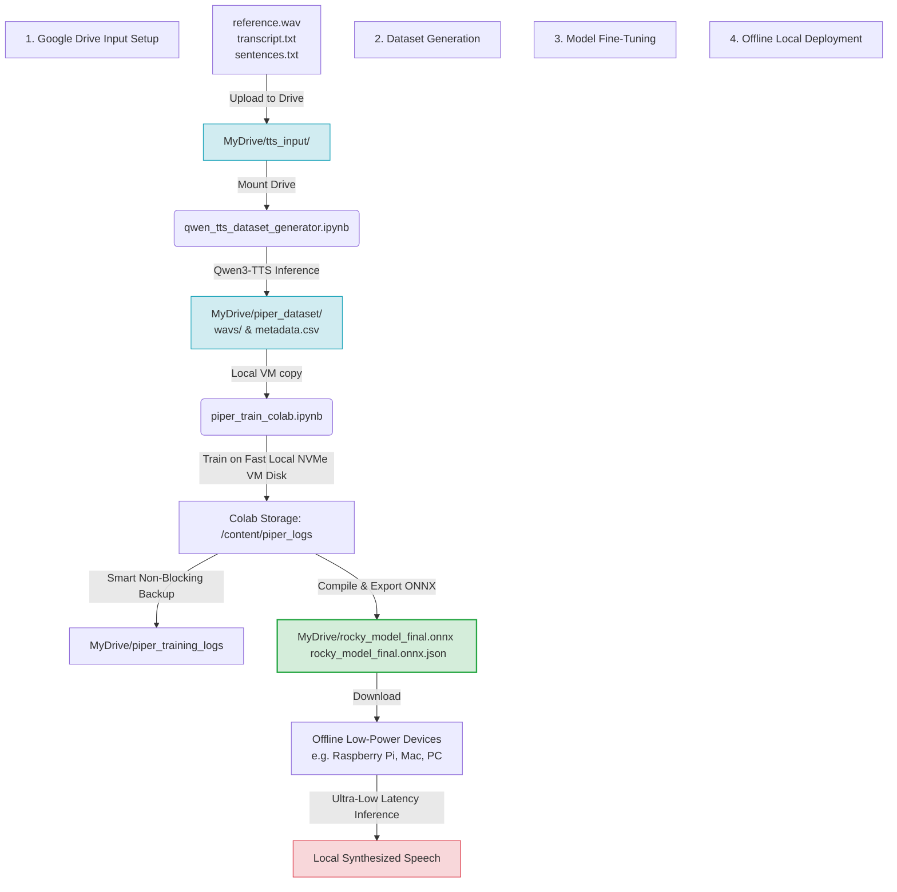

# 🎙️ Qwen-TTS Cloner (Google Colab Edition)

[](https://colab.research.google.com/)
[](https://drive.google.com/)
[](https://github.com/rhasspy/piper)
[](./labs/)

A voice cloning pipeline that leverages **Qwen3-TTS** model family and the **Piper TTS** training engine. 

This repository is optimized for **Google Colab**, offering a workflow to generate large custom voice datasets and train a lightweight, offline-capable **Piper TTS** model. Direct local execution has been quarantined into the `labs/` folder due to the high VRAM requirements and complex dependencies that struggle to run on my MacBook :).

---

## 🗺️ System Workflow



---

## 🚀 Google Colab Quick-Start Guide

To train your custom voice in the cloud using Google Colab and then run the resulting voice model completely offline on any lightweight local computer, follow these four steps:

### Step 1: Prepare and Upload Inputs to Google Drive
Create a folder named `tts_input` in your Google Drive root directory. 
Upload the following three files (examples of which are provided in this repository):

1. **`reference.wav`**: A clean, 3-to-10-second audio recording of the target speaker.
2. **`transcript.txt`**: A text file containing the exact words spoken in `reference.wav`.
3. **`sentences.txt`**: A text file containing a list of sentences (recommended: 100 to 500 prompts) you want the cloned voice to say to create the training corpus.

> [!TIP]
> **Voice Quality Guidelines**
> For perfect voice clones, ensure `reference.wav` is completely "dry" (no background music, no echoes, no static noise) and recorded with a clear, standard microphone.

---

### Step 2: Batch Dataset Generation
Open [qwen_tts_dataset_generator.ipynb](qwen_tts_dataset_generator.ipynb) in Google Colab (tested on **A100 GPU 2025.10 High-RAM** runtime):

1. **Mount Drive**: The notebook will guide you to authorize Google Drive access.
2. **Configure Paths**: Point to your uploaded inputs:
   * Reference Audio: `/content/drive/MyDrive/tts_input/reference.wav`
   * Transcript File: `/content/drive/MyDrive/tts_input/transcript.txt`
   * Targets List: `/content/drive/MyDrive/tts_input/sentences.txt`
3. **Run Batch Synthesis**: The cell downloads the lightweight `qwen-tts` framework and synthesizes all lines in `sentences.txt` in the cloned voice.
4. **Result**: Your Google Drive is populated with an LJSpeech-formatted dataset inside `/MyDrive/piper_dataset` (containing `wavs/` and a normalized `metadata.csv`).

---

### Step 3: Standalone Piper Model Fine-Tuning
Open [piper_train_colab.ipynb](piper_train_colab.ipynb) in Google Colab (tested on **A100 GPU 2025.10 High-RAM** runtime):

> [!IMPORTANT]
> **Google Drive API Protection**
> Training checkpoints and PyTorch Lightning logging write highly frequent I/O operations. Writing these directly to mounted Google Drive folders triggers severe API rate limits and locks up training.
>
> **The Fix**: This notebook performs all training on the **Colab Local VM Storage** (`/content/piper_logs`). A specialized script then performs non-blocking smart backups of your training progress back to Google Drive (`/MyDrive/piper_training_logs`) allowing safe resumes across sessions.

1. **Preprocessing**: The notebook automatically resamples the Qwen-generated audio from 24kHz down to 16kHz (optimized for Piper low/medium quality tiers) and formats it.
2. **Base Checkpoint**: Downloads the pre-trained `Lessac Low` checkpoint to begin transfer learning.
3. **Training Execution**: Fine-tunes the model. A Tensorboard widget displays live training loss.
4. **ONNX Compilation**: The final cell compiles the absolute latest checkpoint (`.ckpt`) into an optimized `.onnx` graph and packs it with its matching `.onnx.json` configuration file, dropping both in your Google Drive root.

---

### Step 4: Local Offline Deployment
Once training is finished, download the compiled `.onnx` and `.onnx.json` files from your Google Drive. You can run high-fidelity text-to-speech completely offline locally on Raspberry Pi!

```bash
echo "Science saves the world. It's a good plan." | \
  piper --model my_custom_model.onnx \
        --output_file custom_voice_output.wav
```

**Piper TTS Demo Video:**<br>
<a href="https://youtu.be/tMpZ1kpeqoA" target="_blank">
  
</a>

---

## 📂 Project Structure

```text
├── qwen_tts_dataset_generator.ipynb  # Primary: Generates LJSpeech datasets via Colab
├── piper_train_colab.ipynb           # Primary: Fine-tunes and exports Piper models on Colab
├── sentences.txt                     # calibration sentences (500 lines) for dataset generation
├── transcript.txt                    # Reference transcript template
├── labs/                             # QUARANTINED experimental local execution tools
│   ├── clone_voice.py                # Local zero-shot voice cloning CLI tool
│   ├── pyproject.toml                # UV environment definitions
│   ├── uv.lock                       # Lockfile for direct local environment sync
│   └── .python-version               # Python version target (3.14)
└── README.md                         # This file
```

---

## 🧪 Labs: Experimental Local Voice Cloning

If you have a powerful local system, you can run local synthesis in the `labs/` directory.

> [!WARNING]
> Local cloning is **highly experimental** and prone to Out-Of-Memory (OOM) errors, complex dependency resolution, and slower execution on standard laptops. I haven't successfully tested this on a local system yet.

### Run Local CLI Cloning
Ensure you have [uv](https://docs.astral.sh/uv/) installed:
```bash
# Navigate to labs
cd labs

# Synchronize virtual env
uv sync

# Run cloning CLI
uv run clone_voice.py \
    --ref_audio "../reference.wav" \
    --ref_text "Exactly what is said in reference audio." \
    --gen_text "Synthesizing this text using local local resources." \
    --output "local_output.wav"
```

---

## 📜 Credits

* **Qwen3-TTS**: The model architecture is built by [Qwen Team](https://github.com/QwenLM/Qwen3-TTS).
* **Piper TTS**: Fast, local neural text-to-speech system developed by [Rhasspy](https://github.com/rhasspy/piper).
